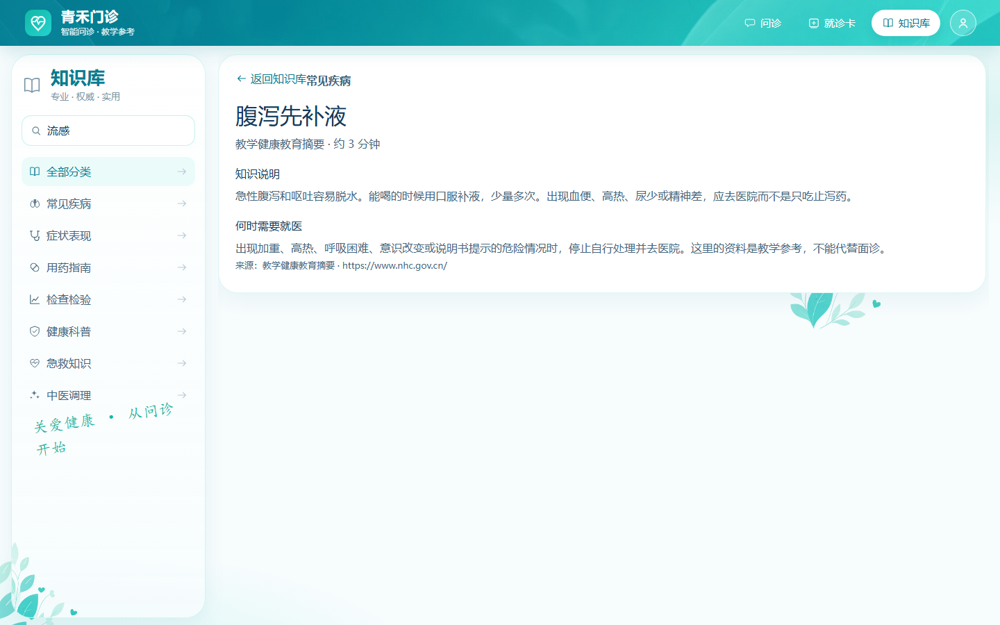
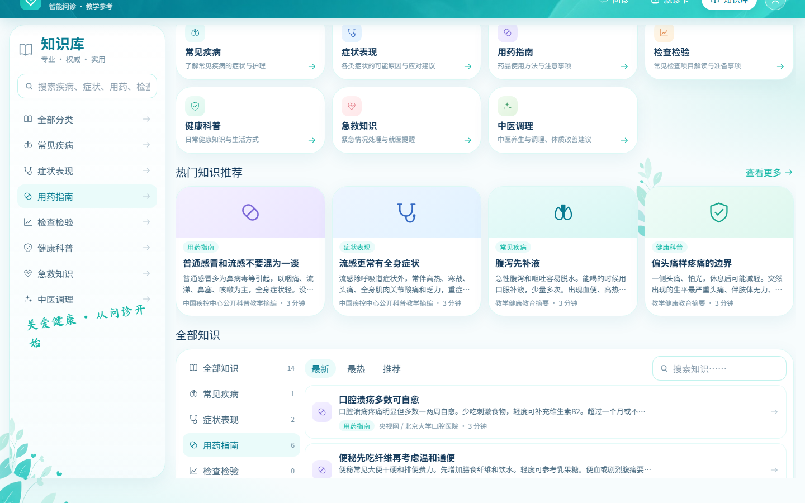
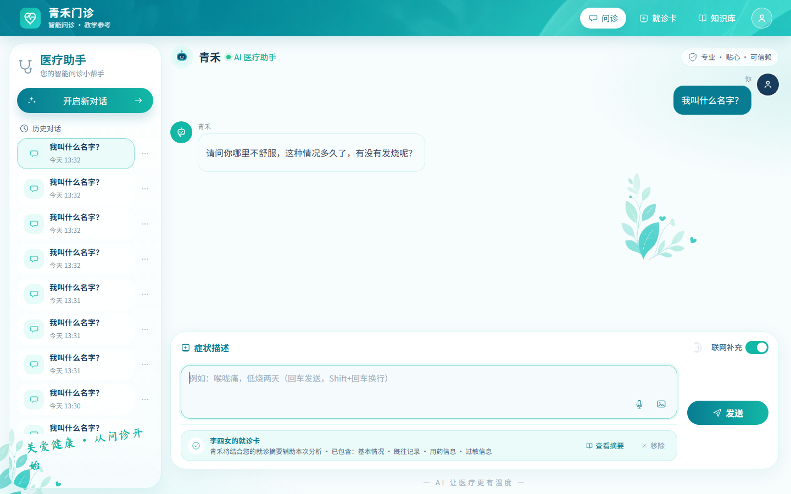

# Bug 记录（课堂汇报版）

> 筛选口径：只记录当前版本中能够稳定重复、实际结果明确偏离预期行为的问题。  
> 本轮三个问题均在同一激活条件下复现 **3/3 次**。原记录中的过期会话、多卡唯一索引等问题已经修复，不再作为“当前存在的 Bug”汇报。

## Bug-01｜正在阅读文章时，搜索框不生效

| 项 | 内容 |
| --- | --- |
| **Bug 类型** | 页面状态 / 功能逻辑 |
| **严重程度** | 中等 |
| **激活条件** | 知识库已经打开任意一篇文章，例如《腹泻先补液》。此时左侧搜索框仍然可见。 |
| **复现步骤** | ① 进入知识库并打开《腹泻先补液》；② 在左侧搜索框输入“流感”；③ 观察页面是否切换到搜索结果。 |
| **预期结果** | 退出当前文章，展示标题或摘要包含“流感”的知识条目。 |
| **实际结果** | 搜索框里已经是“流感”，但页面仍停留在《腹泻先补液》，没有出现流感相关结果。 |
| **重复验证** | 同一篇文章中重复输入并清空搜索词 3 次，每次都停留在原文，复现率 **3/3**。 |
| **代码证据** | 搜索框只执行 `setQuery()`；`openId` 只有在切换分类或点击“返回知识库”时才被清空，因此详情视图会挡住新的搜索结果。 |

## Bug-02｜感冒科普被程序分进“用药指南”

| 项 | 内容 |
| --- | --- |
| **Bug 类型** | 分类逻辑 |
| **严重程度** | 中等 |
| **激活条件** | 使用系统当前内置知识库，不需要修改任何数据。文章本身的病种编码是 `URI`（普通感冒）。 |
| **复现步骤** | ① 进入知识库；② 点击左侧“用药指南”；③ 查看《普通感冒和流感不要混为一谈》的分类标签；④ 再点击“常见疾病”对比。 |
| **预期结果** | 这篇感冒科普出现在“常见疾病”中，不应归入“用药指南”。 |
| **实际结果** | “用药指南”共 6 篇，其中包含这篇感冒文章；“常见疾病”只剩 1 篇，找不到它。 |
| **重复验证** | 连续请求知识库接口 3 次，该文章的分类每次都是“用药指南”，复现率 **3/3**。 |
| **代码证据** | `KnowledgeCatalog.categoryOf()` 先检查“抗生素”等词。文章关键词写有“抗生素”，于是在判断疾病主题之前就被返回为 `drug`。 |

## Bug-03｜新会话首条消息没有真正应用已关联的就诊卡

| 项 | 内容 |
| --- | --- |
| **Bug 类型** | 状态同步 / 功能逻辑 |
| **严重程度** | 高 |
| **激活条件** | 处于尚未发送消息的新会话，此时 `sessionId` 为空；先选择一张已有就诊卡，再发送第一条消息。 |
| **复现步骤** | ① 点击“开启新对话”；② 点击“添加就诊卡”，选择“李四女的就诊卡”；③ 确认页面显示“青禾将结合您的就诊摘要”；④ 发送“我叫什么名字？”。 |
| **预期结果** | 创建新会话后同步写入所选就诊卡，首条回复能够读取卡片信息并回答姓名。 |
| **实际结果** | 页面仍显示就诊卡已关联，但新会话后端的 `profileLinked=false`；回复转而追问“哪里不舒服”，没有使用卡片。 |
| **重复验证** | 连续建立 3 个新会话，3 次后端上下文均为 `profileLinked=false`，复现率 **3/3**。 |
| **代码证据** | `saveLink()` 在 `sessionId == null` 时直接返回成功；`openSession()` 创建会话后没有补调 `/context` 写入 `profileId`，只在消息中发送 `useProfile: true`。 |

## 证据与复现材料

- 自动复现结果：`项目报告/BUG证据/复现结果.json`
- 截图生成脚本：`项目报告/BUG证据/生成BUG截图.py`
- 运行环境：Windows、Chrome、前端 `5173`、后端 `8082`、MySQL `3306`

## 未计入本次汇报的问题

- 已经修复的过期会话、多卡唯一索引：属于历史 Bug，但当前版本无法再复现。
- 未实现账号登录、没有就诊卡删除按钮：属于范围或功能缺失，不能直接当成此次发现的 Bug。
- 颜色、间距、个人审美：属于体验评价，不作为功能 Bug。
